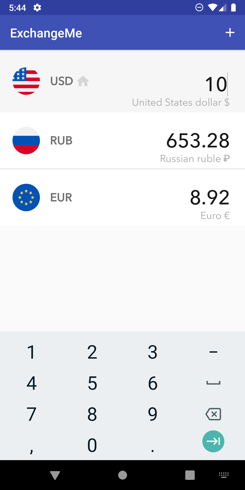
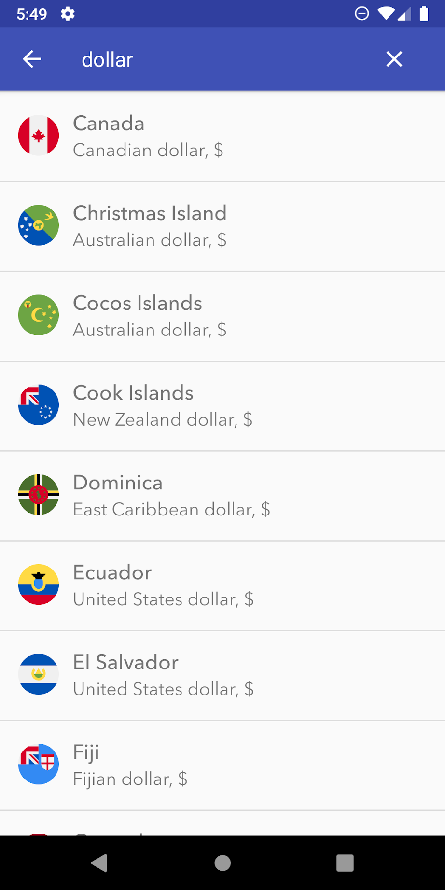
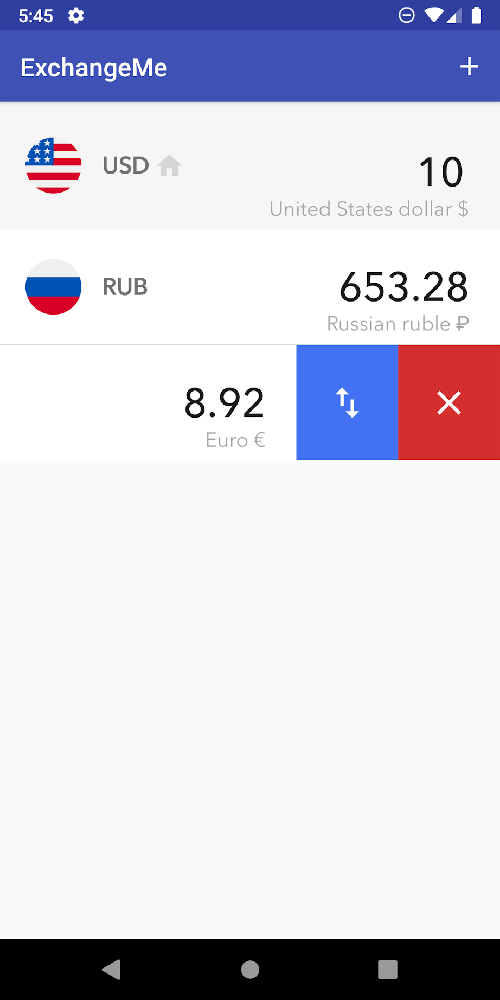
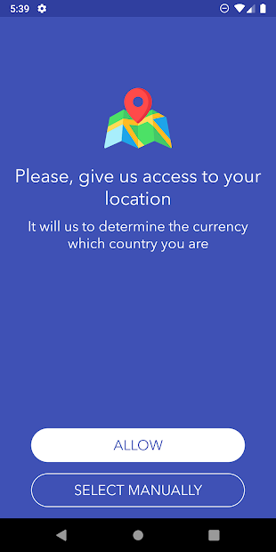

# ExchangeMe

This application helps you to convert one currency to another. It works offline, so you don't need to have a permanent Wi-Fi connection. It can recognize which country you are now and choose the currency for this country.

        

For development the following stack was used:

* Clean Architecture with MVP
* Room
* RxJava 2
* Dagger 2
* Moxy
* Retrofit

